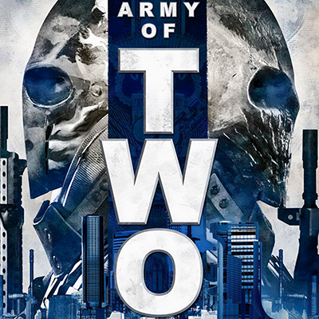

# Army Of Two XBOX360 Recompilation



A static recompilation of [**Army of Two**](https://en.wikipedia.org/wiki/Army_of_Two) (2008, EA Montreal / Electronic Arts, Xbox 360;
**USA release, Title ID `454107F8`**) to native Windows x86-64,
built on the [ReXGlue SDK](https://github.com/rexglue/rexglue-sdk).

**Based on [nikolaygorb/ArmyOfTwoRecomp](https://github.com/nikolaygorb/ArmyOfTwoRecomp)
by [nikolaygorb](https://github.com/nikolaygorb)**, the original recompilation
of the Europe release (`4541084C`). The codegen setup, `default_functions.toml`,
the app, the settings and the game patches are his work; this repository keeps
his commit history and adds the USA retarget and the fixes listed under
[Status](#status).

The USA disc needs its own build. The two `default.xex` files
have the same function layout (`.pdata` is byte-identical, same entry point
`0x82A3C128`) but a different `.rdata` layout, so ~55 700 instructions carry
different data addresses: a build made from one XEX cannot run the other.
Codegen on the USA `default.xex` with the same `default_functions.toml` gives
a USA build; no retarget-specific guest overrides are needed.

Static recompilation translates the Xbox 360 PowerPC code inside the game's
`default.xex` into native C++ that compiles and runs on a PC. There is no
emulator and no interpreter in the loop; file I/O, GPU commands, audio and
threading go through the ReXGlue runtime.

<br clear="right">

## Status

The USA build boots and plays: codegen runs clean, the game reaches gameplay
with sound, controller and correct lighting.

Changes on top of upstream:

| Change | Where |
|---|---|
| Retarget to the USA disc (`454107F8`) | codegen on the USA `default.xex`, [`CMakeLists.txt`](CMakeLists.txt) |
| Crash fix: the SDK's `InputSystem` has no lock, and parallel `XamInputGetState` / `GetCapabilities` / `SetState` calls can free its device list twice (caught once as heap corruption `0xC0000374`, ~45 s in, with a pad connected; the race is timing-dependent). The three guest XInput wrappers now run under one mutex. | [`src/game_fixes.h`](src/game_fixes.h) |
| Lighting fix: `readback_resolve = "fast"` (UE3 HDR eye adaptation reads resolved render targets on the CPU; without it the image is washed out and tinted), `render_target_path_d3d12 = "rov"`, `gamma_render_target_as_unorm16 = true`, `resolution_scale = 1` | [`settings/hardware.toml`](settings/hardware.toml) |
| Runtime debug tools (stub sweep, 97 MB missing-function scan) off by default | [`settings/hardware.toml`](settings/hardware.toml) |

## Requirements

- CMake 3.25+
- Ninja
- Clang / LLVM
- [ABGX360](https://github.com/BakasuraRCE/abgx360) to dump the Xbox 360 disc,
  or [extract-xiso](https://github.com/XboxDev/extract-xiso/releases) to
  unpack an existing ISO
- Your own legally-owned copy of Army of Two, extracted from the Xbox 360 disc/ISO

The ReXGlue SDK release archive is auto-downloaded by the CMake configure
step - see [Getting the SDK](#getting-the-sdk).

## Getting the SDK

The ReXGlue SDK version is pinned in [`CMakeLists.txt`](CMakeLists.txt)
(`REXSDK_VERSION "0.10.0.8-dev.g1406e1b"`). The CMake configure step
auto-downloads the matching nightly release archive for your platform
(Windows / Linux / macOS) into `rexglue/<platform>/` via
[`cmake/fetch-rexglue-sdk.cmake`](cmake/fetch-rexglue-sdk.cmake) - no manual
download needed. The SDK itself is gitignored; only
[`rexglue/README.md`](rexglue/README.md) is checked in.

## Getting the game data

1. Dump the Xbox 360 disc with
   [ABGX360](https://github.com/BakasuraRCE/abgx360) (verify against the
   hashes below) or extract an existing ISO with
   [extract-xiso](https://github.com/XboxDev/extract-xiso/releases), which
   unpacks the disc's file tree.
2. Copy the extracted contents directly into `assets/`, so `default.xex`
   sits at `assets/default.xex` alongside the rest of the disc's files
   (`AO2Game/`, `$SystemUpdate/`, ...).
3. `assets/` is gitignored (`assets/*` in `.gitignore`, with a couple of
   small tracked exceptions) - nothing from the disc is, or should be,
   committed to this repo.

Target retail release (verify your dump matches):

| Field | Value |
|---|---|
| Disc | Army of Two (USA) |
| Title ID | `454107F8` |
| Media ID | `38595BF0` |
| `default.xex` SHA-1 | `0228895185EB2F1750C4B729F6CB73C36E82816A` |

The Europe disc (`4541084C`, Media ID `7E3E9BEA`) needs the upstream
project instead: the recompiled code is tied to one XEX.

## Build

```powershell
cmake --preset win-amd64-release
cmake --build --preset win-amd64-release
```

```bash
cmake --preset linux-amd64-release
cmake --build --preset linux-amd64-release
```

```bash
cmake --preset mac-amd64-release
cmake --build --preset mac-amd64-release
```

Other presets (`*-debug`, `*-relwithdebinfo`, `*-arm64`) are listed in
[`CMakePresets.json`](CMakePresets.json).

Codegen (translating `assets/default.xex` into `generated/default/*.cpp`) runs
automatically as a build step (`armyoftworecomp_codegen` CMake target)
whenever `armyoftworecomp_manifest.toml` or an included `.toml`
changes. It can also be run directly: `rexglue\win-amd64\bin\rexglue.exe
codegen`.

## Run

```powershell
cd out\build\win-amd64-release
.\armyoftworecomp.exe
```

```bash
cd out/build/linux-amd64-release
./armyoftworecomp
```

```bash
cd out/build/mac-amd64-release
./armyoftworecomp
```

Both `--game_data_root` and `--gpu_plugin` are optional: `OnConfigurePaths()`
in [`src/armyoftworecomp_app.h`](src/armyoftworecomp_app.h)
defaults `game_data_root` to `<repo_root>/assets` when it isn't set via
flag/env var, and `gpu_plugin = "xenos"` already lives in
[`settings/hardware.toml`](settings/hardware.toml).

Useful extra flags/env vars while developing:

| Flag / env var | Effect |
|---|---|
| `--game_data_root <path>` | Overrides the default `<repo_root>/assets` game-files location. |
| `--gpu_plugin xenos` | Overrides `settings/hardware.toml`'s `gpu_plugin`. Only needed if you want a different plugin than the file specifies. |
| `--graphics_backend d3d12\|vulkan\|any` | Forces the graphics API `rexgpu-xenos` uses (cvar, default `"any"`, which picks D3D12 first). See [`settings/README.md`](settings/README.md). |
| `--ao2_fps_unlock=true` | Ported xenia-canary `game-patches` "Unlock FPS" patch for Army of Two retail. Enabled by default in [`settings/hardware.toml`](settings/hardware.toml). See [`settings/README.md`](settings/README.md). |
| `--ao2_fps_unlock_mode=0\|1\|2` | Frame-rate target when `ao2_fps_unlock` is on: `0`=unlimited, `1`=60 FPS, `2`=30 FPS. Default `1`. |
| `--ao2_disable_msaa=true` | Ported xenia-canary `game-patches` "Black Shading Fix" (disables MSAA). Enabled by default in [`settings/hardware.toml`](settings/hardware.toml). |
| `--ao2_anisotropic_16x=true` | Ported xenia-canary `game-patches` "16x Anisotropic Filtering". Off by default. |

Logs are written to `out\build\<preset>\logs\*.log` (the exe is built `WIN32`,
so nothing prints to the console).

## Configuration

Rendering/window/vsync and input-backend defaults are checked in under
[`settings/`](settings/README.md) (`hardware.toml` / `mapping.toml`), loaded
automatically at startup. CLI flags and `REX_*` environment variables always
override them - see [`settings/README.md`](settings/README.md) for the full
reference and precedence rules.

## Credits

- [nikolaygorb/ArmyOfTwoRecomp](https://github.com/nikolaygorb/ArmyOfTwoRecomp) -
  the original project this repository is built on (Europe release)
- [ReXGlue SDK](https://github.com/rexglue/rexglue-sdk) ([releases](https://github.com/rexglue/rexglue-sdk/releases))
- [ABGX360](https://github.com/BakasuraRCE/abgx360) - used to dump the Xbox 360 disc
- [extract-xiso](https://github.com/XboxDev/extract-xiso) ([releases](https://github.com/XboxDev/extract-xiso/releases)) -
  used to unpack the Xbox 360 ISO into the file tree copied into `assets/`
- [xenia](https://github.com/xenia-project/xenia) / [xenia-canary](https://github.com/xenia-canary/xenia-canary) -
  ReXGlue's runtime is derived from Xenia's
- [xenia-canary/game-patches](https://github.com/xenia-canary/game-patches) -
  source of the ported `ao2_fps_unlock` / `ao2_disable_msaa` /
  `ao2_anisotropic_16x` patches
- [xenia-manager/optimized-settings](https://github.com/xenia-manager/optimized-settings) and
  [xenia game-compatibility #167](https://github.com/xenia-project/game-compatibility/issues/167) -
  the `readback_resolve` lighting fix for `454107F8`
- [mdqinc/SDL_GameControllerDB](https://github.com/mdqinc/SDL_GameControllerDB) -
  `settings/gamecontrollerdb.txt`

## License

The upstream project does not declare a license, so its code stays under its
author's copyright. Ask [nikolaygorb](https://github.com/nikolaygorb) before
redistributing it outside GitHub's fork mechanism. Game files are not part of
this repository and must come from your own disc.
